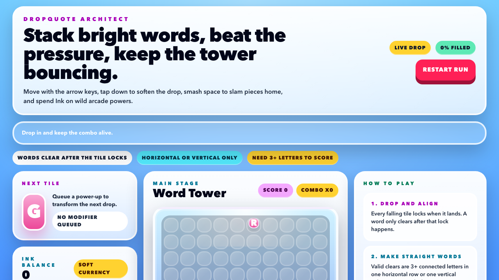

# DropQuote Architect

Arcade-style word-stacking game built with React, Vite, Tailwind CSS v4, and Redux Toolkit entity state.



## What It Is

DropQuote Architect is a real-time browser game where single letter tiles fall into a 10x20 board. Your goal is to steer each letter into place so that, once it locks, it completes a valid horizontal or vertical word of at least 3 letters.

When words clear:

- space opens up
- unsupported tiles fall
- combos can trigger follow-up clears
- pressure drops
- Ink is earned for power-ups

If the board gets too crowded and the pressure meter reaches 100%, the run ends.

## How To Play

Core rules:

- A word only clears after the falling tile locks into the grid.
- Only straight horizontal or vertical words count.
- Words must be at least 3 letters long.
- Diagonal strings do not count.
- Pressure rises as locked tiles accumulate.

Starter words that are accepted by the current dictionary include:

`CAT`, `DOG`, `SUN`, `STAR`, `CODE`, `GAME`, `TILE`, `STACK`

Controls:

- `Left Arrow` / `Right Arrow`: move the falling tile
- `Down Arrow`: soft drop
- `Space`: hard drop
- `1`, `2`, `3`: use power-ups from inventory slots
- `C`: clear the queued next-drop modifier

The live UI now includes persistent how-to-play hints and example words so the rules stay visible during gameplay.

## Power-Ups

- `Steel Beams`: modifies the next dropped tile; if that tile is part of a cleared word, the row is fortified and pressure drops sharply.
- `Wrecking Ball`: destroys an entire column from the current drop lane downward.
- `Mortar`: turns the next dropped tile into a wildcard.

Power-ups are bought with Ink and stored in a 3-slot side inventory.

## Gameplay Systems

- `Entity-driven board state`: tiles are stored with RTK `createEntityAdapter` instead of a mutable 2D string array.
- `Discrete tick loop`: falling motion is driven by a custom React hook and RTK actions, with no physics engine.
- `Word scanning`: valid words are detected from settled board state after each lock/board update.
- `Cascades`: clears trigger gravity, which can trigger more clears.
- `Pressure meter`: the fuller the board gets, the faster the global tick rate becomes.
- `Pressure chart`: rendered through an isolated `PressureChart` adapter so the HUD can evolve without touching game logic.

## Tech Stack

- React 19
- TypeScript
- Vite
- Tailwind CSS v4
- Redux Toolkit
- React Redux
- Vitest
- Testing Library

## Project Structure

High-signal folders:

- [`src/app`](src/app): Redux store and typed hooks
- [`src/features`](src/features): slices, selectors, and gameplay thunks
- [`src/game`](src/game): domain types, constants, and pure utility logic
- [`src/components`](src/components): UI panels, board, and pressure chart
- [`src/hooks`](src/hooks): tick loop and keyboard input hooks
- [`src/test`](src/test): unit and integration tests

Dictionary data lives in `src/data/dictionary.json` and is excluded through `.aiignore`.

## Local Development

Install dependencies:

```bash
npm install
```

Start the dev server:

```bash
npm run dev
```

Run tests:

```bash
npm test
```

Run linting:

```bash
npm run lint
```

Create a production build:

```bash
npm run build
```

## Testing Coverage

The current test suite covers:

- collision and movement boundaries
- word scanning
- wildcard resolution
- gravity/collapse behavior
- pressure scaling
- game-loop integration
- power-up behaviors including Wrecking Ball and Steel fortification

## GitHub Pages Deployment

This repo is configured to deploy to GitHub Pages through GitHub Actions.

Expected production URL:

[https://stonedhawk.github.io/DropQuote-Architect/](https://stonedhawk.github.io/DropQuote-Architect/)

The workflow is defined in:

- [`.github/workflows/deploy-pages.yml`](.github/workflows/deploy-pages.yml)

Vite’s Pages base path handling is configured in:

- [`vite.config.ts`](vite.config.ts)

## Current Status

Implemented:

- playable falling-tile loop
- RTK entity-based board state
- word clearing and cascades
- pressure tracking and chart HUD
- Ink economy and 3 power-ups
- persistent live gameplay hints
- test suite and GitHub Pages deployment workflow

Next likely improvements:

- richer dictionary data
- stronger clear/combo animations and sound
- title screen and game-over overlay polish
- more deliberate balance tuning for pressure and Ink
